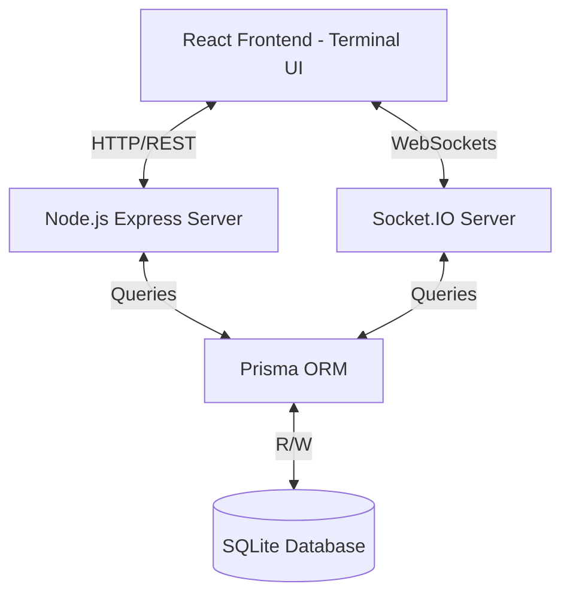
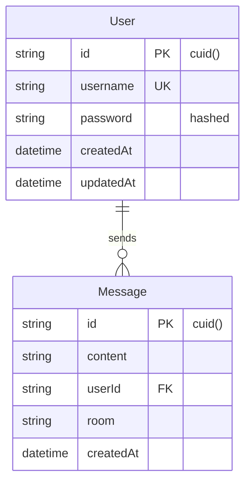
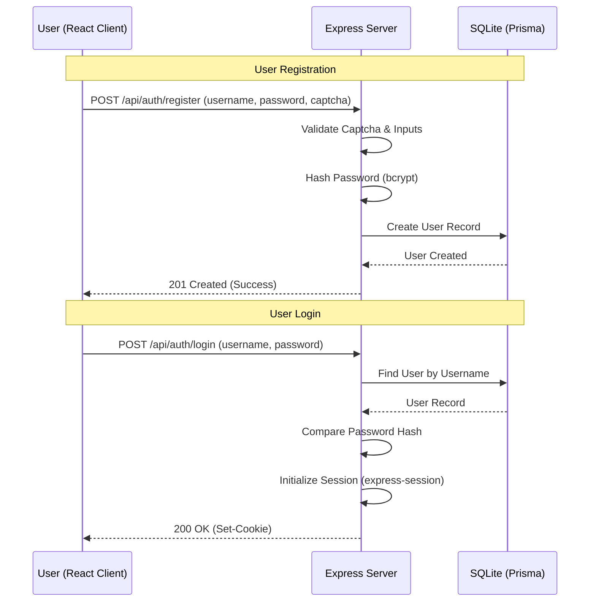
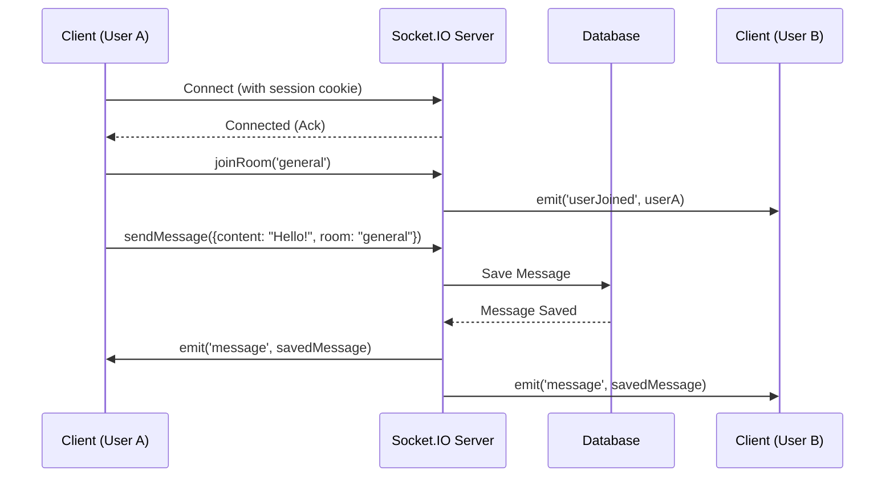
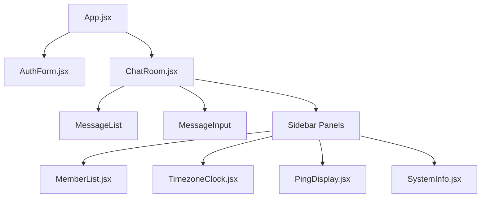

# 🌐Obsidian

A fully immersive real-time terminal-style chatroom application with a professional darkweb/hacker aesthetic. Built with Node.js, Express, Socket.IO, React, and SQLite.

    

## 📑 Table of Contents
- [🎯 Features](#-features)
- [🏗️ Architecture & System Design](#️-architecture--system-design)
  - [System Architecture](#system-architecture)
  - [Database Schema (ERD)](#database-schema-erd)
  - [Authentication Flow](#authentication-flow)
  - [Real-time Messaging Flow](#real-time-messaging-flow)
  - [Component Architecture](#component-architecture)
- [🛠️ Quick Start](#️-quick-start)
- [📁 Project Structure](#-project-structure)
- [🎮 Usage](#-usage)
- [🔧 Configuration](#-configuration)
- [🖥️ Terminal Interface Showcase](#️-terminal-interface-showcase)
- [🚀 Deployment](#-deployment)
- [🛡️ Security Considerations](#️-security-considerations)
- [🎨 Customization](#-customization)
- [🐛 Troubleshooting](#-troubleshooting)
- [📝 API Endpoints](#-api-endpoints)
- [🤝 Contributing](#-contributing)
- [📄 License](#-license)
- [🎯 Roadmap](#-roadmap)

## 🎯 Features

### 🧠 Core Functionality
- **Real-time messaging** with Socket.IO WebSockets
- **Multi-room support** (general, dev-lounge, cyber-lab)
- **User authentication** with bcrypt password hashing
- **Session management** with express-session
- **Message persistence** with SQLite database
- **Typing indicators** and user presence tracking

### 🖥️ Professional Terminal Interface
- **Authentic terminal windows** with title bars and controls
- **Multi-panel dashboard** with real-time information
- **Active member list** with online status and ping measurements
- **World clock display** with 12+ timezones
- **Connection status panel** with real-time ping monitoring
- **System information dashboard** with live statistics
- **Enhanced status bar** with session details

### 🎨 Immersive Terminal Aesthetic
- **Professional dark theme** with authentic terminal styling
- **Neon green** (#00ff6a) and **cyan** (#00eaff) color scheme
- **JetBrains Mono typography** for authentic terminal feel
- **Advanced CRT effects** including flicker, scanlines, and glow
- **Pulsing animations** for status indicators and user activity
- **Terminal window styling** with proper borders and shadows
- **Enhanced scrollbars** with neon gradient styling

### 🔒 Enterprise Security Features
- **Password hashing** with bcrypt (12 rounds)
- **Message sanitization** with DOMPurify (XSS prevention)
- **Rate limiting** on authentication endpoints
- **Session protection** with secure cookies
- **Math-based CAPTCHA** for registration/login
- **Input validation** and comprehensive sanitization
- **CSRF protection** ready for production

### 🚀 Modern Technical Stack
- **Backend**: Node.js + Express + Socket.IO
- **Frontend**: React + Vite + Custom CSS (no framework dependencies)
- **Database**: SQLite with Prisma ORM (zero setup required)
- **Authentication**: bcrypt + express-session
- **Real-time**: Socket.IO WebSockets with ping/pong monitoring

## 🏗️ Architecture & System Design

To provide a comprehensive understanding of how Obsidian operates, below are visual representations of the system architecture, database structure, and core workflows.

### System Architecture
The application follows a standard client-server model augmented with WebSockets for real-time bidirectional communication.



### Database Schema (ERD)
Obsidian uses SQLite via Prisma ORM. The relational model is intentionally kept lightweight and efficient.



### Authentication Flow
User authentication is managed securely using bcrypt and express-session cookies.



### Real-time Messaging Flow
Real-time interaction relies on Socket.IO, enabling instant delivery and multi-room broadcasting.



### Component Architecture
The React frontend is component-driven, heavily utilizing hooks to manage terminal UI state and WebSocket connections.



## 🛠️ Quick Start

### Prerequisites
- Node.js (v18 or higher)
- npm or yarn
- No database setup required! (Uses SQLite - automatically created)

### Installation

1. **Clone and install dependencies:**
   ```bash
   git clone <repository-url>
   cd darkweb-chatroom
   npm run install-all
   ```

2. **Initialize the database (automatic!):**
   ```bash
   cd server
   npx prisma generate
   npx prisma db push
   ```
   This creates a SQLite database file at `server/prisma/dev.db` - no additional setup needed!

3. **Start the application:**
   ```bash
   # From root directory
   npm run dev
   ```

This will start:
- Backend server on `http://localhost:3001`
- Frontend development server on `http://localhost:5173` (or next available port)

**Note**: If ports are in use, Vite will automatically find the next available port (5174, 5175, etc.)

## 📁 Project Structure

```
darkweb-chatroom/
├── client/                 # React frontend
│   ├── src/
│   │   ├── components/    # React components
│   │   │   ├── AuthForm.jsx      # Terminal-style login/register
│   │   │   ├── ChatRoom.jsx      # Main chatroom interface
│   │   │   ├── MemberList.jsx    # Active members with ping
│   │   │   ├── TimezoneClock.jsx # World clocks display
│   │   │   ├── PingDisplay.jsx   # Connection status
│   │   │   └── SystemInfo.jsx    # System statistics
│   │   ├── App.jsx        # Main app component
│   │   ├── main.jsx       # React entry point
│   │   └── index.css      # Enhanced terminal styling
│   └── package.json
├── server/                # Node.js backend
│   ├── prisma/
│   │   ├── schema.prisma  # SQLite database schema
│   │   └── dev.db         # SQLite database (auto-created)
│   ├── index.js          # Express server with Socket.IO
│   ├── setup-db.js       # Database setup script
│   └── package.json
├── package.json          # Root package with scripts
├── README.md            # This file
└── setup.md            # Detailed setup instructions
```

## 🎮 Usage

### Authentication
1. **Register**: Create a new account with username/password
2. **Login**: Access existing account
3. **CAPTCHA**: Solve math problems for verification

### Enhanced Terminal Interface
1. **Professional Dashboard**: Multi-panel terminal windows
2. **Active Members**: Real-time user list with ping measurements
3. **World Clocks**: 12+ timezone displays with live updates
4. **Connection Status**: Real-time ping monitoring and quality indicators
5. **System Information**: Live statistics including uptime, message count, system load
6. **Enhanced Chat**: Typing indicators, improved message styling, terminal prompts

### Chat Features
1. **Multi-Room Support**: Switch between general, dev-lounge, cyber-lab
2. **Real-time Messaging**: Instant message delivery with Socket.IO
3. **User Presence**: See who's online with status indicators
4. **System Logs**: View user join/leave events and system messages
5. **Terminal Commands**: Command-line style interaction with authentic prompts

## 🔧 Configuration

### Environment Variables

Create `server/.env` with the following:

```env
# Database (SQLite - no setup required!)
# The database file is automatically created at: server/prisma/dev.db

# Session Secret (change in production)
SESSION_SECRET="your-super-secret-session-key-here"

# Server
PORT=3001
NODE_ENV=development
```

### Database Schema Details

The application uses SQLite with the following Prisma schema logic:

```prisma
model User {
  id        String   @id @default(cuid())
  username  String   @unique
  password  String
  createdAt DateTime @default(now())
  updatedAt DateTime @updatedAt
  messages  Message[]
}

model Message {
  id        String   @id @default(cuid())
  content   String
  userId    String
  room      String   @default("general")
  createdAt DateTime @default(now())
  user      User     @relation(fields: [userId], references: [id])
}
```

### Component Architecture Details

The enhanced terminal interface includes these key components:
- **AuthForm**: Terminal-style authentication with math CAPTCHA
- **ChatRoom**: Main chatroom with multi-panel dashboard
- **MemberList**: Active users with real-time ping measurements
- **TimezoneClock**: World clocks with 12+ timezone support
- **PingDisplay**: Connection status and latency monitoring
- **SystemInfo**: Live system statistics and session information

## 🖥️ Terminal Interface Showcase

### Dashboard Panels
The enhanced terminal interface provides a comprehensive dashboard with multiple information panels:

#### 👥 Member List Panel
- Real-time user presence tracking
- Individual ping measurements for each user
- Color-coded connection quality (green=excellent, cyan=good, yellow=fair, red=poor)
- Online/offline status indicators with pulsing animations

#### 🌍 World Clock Panel
- 12+ major timezones including UTC, New York, London, Tokyo, Sydney
- Real-time updates every second
- Date and time display for each timezone
- Professional terminal styling

#### 📡 Connection Status Panel
- Real-time ping measurement to server
- Connection quality rating (Excellent/Good/Fair/Poor)
- Server information and protocol details
- Visual connection status indicators

#### 📊 System Information Panel
- Session uptime counter
- Message count tracking
- Simulated system load and memory usage
- Network status and browser information
- Live updates every second

### Terminal Aesthetics
- **Authentic terminal windows** with proper title bars and window controls
- **Advanced CRT effects** including flicker, scanlines, and glow animations
- **Professional color scheme** with neon green (#00ff6a) and cyan (#00eaff)
- **Enhanced scrollbars** with gradient styling
- **Pulsing animations** for status indicators and user activity
- **Terminal-style command prompts** throughout the interface

## 🚀 Deployment

### Production Setup

1. **Environment Configuration:**
   ```bash
   NODE_ENV=production
   SESSION_SECRET=your-secure-session-secret
   # Ensure SQLite is accessible or switch to PostgreSQL
   ```

2. **Build Frontend:**
   ```bash
   cd client
   npm run build
   ```

3. **Start Production Server:**
   ```bash
   cd server
   npm start
   ```

### Docker Deployment (Optional)

```dockerfile
# Dockerfile example
FROM node:18-alpine
WORKDIR /app
COPY package*.json ./
RUN npm install
COPY . .
RUN npm run build
EXPOSE 3001
CMD ["npm", "start"]
```

## 🛡️ Security Considerations

- **Password Security**: bcrypt with 12 rounds
- **Session Security**: Secure, HTTP-only cookies
- **XSS Prevention**: DOMPurify message sanitization
- **Rate Limiting**: Prevents brute force attacks
- **Input Validation**: Server-side validation for all inputs
- **CORS Configuration**: Proper origin restrictions

## 🎨 Customization

### Terminal Theme
Modify `client/src/index.css` to customize:
- Colors (neon-green, neon-cyan)
- Animations (cursor-blink, glow-pulse)
- Typography (JetBrains Mono)
- Effects (scanlines, glows)

### Adding Rooms
Update the `rooms` array in `ChatRoom.jsx`:

```javascript
const rooms = [
  { id: 'general', name: '/general' },
  { id: 'dev-lounge', name: '/dev-lounge' },
  { id: 'cyber-lab', name: '/cyber-lab' },
  { id: 'new-room', name: '/new-room' }  // Add new room
];
```

## 🐛 Troubleshooting

### Common Issues

1. **Port Conflicts (`EADDRINUSE`):**
   ```bash
   # Kill process occupying port 3001 (macOS/Linux)
   lsof -ti:3001 | xargs kill -9
   ```
2. **Database Generation Failed:**
   Run `npx prisma generate` again inside the `/server` directory.

3. **Socket.IO Connection Issues:**
   - Check CORS configuration in Express
   - Verify client connects to the correct port (usually 3001)

### Debug Mode

Enable debug logging to see full Socket.IO output:

```bash
DEBUG=socket.io:* npm run dev
```

## 📝 API Endpoints

### Authentication
- `POST /api/auth/register` - User registration
- `POST /api/auth/login` - User login
- `POST /api/auth/logout` - User logout
- `GET /api/auth/me` - Get current user status

### Messages
- `GET /api/messages/:room` - Fetch chat history for a room
- `WebSocket` - Emit/listen for real-time messages

## 🤝 Contributing

1. Fork the repository
2. Create a feature branch
3. Make your changes
4. Add tests if applicable
5. Submit a pull request

## 📄 License

MIT License - see LICENSE file for details

## 🎯 Roadmap

### Completed ✅
- [x] Professional terminal interface with multi-panel dashboard
- [x] Real-time member list with ping measurements
- [x] World clock display with multiple timezones
- [x] Connection status monitoring
- [x] System information dashboard
- [x] Enhanced terminal aesthetics and animations
- [x] Typing indicators and user presence
- [x] SQLite database for zero-setup deployment

### Planned Features 🚀
- [ ] File sharing capabilities
- [ ] Private messaging
- [ ] Message encryption
- [ ] Voice chat integration
- [ ] Advanced terminal commands
- [ ] User roles and permissions
- [ ] Message search functionality
- [ ] Custom theme selection
- [ ] Terminal sound effects
- [ ] Mobile responsive design

---

**⚠️ Disclaimer**: This is a fictional "darkweb" themed application for educational purposes only. It does not connect to any real dark web services or networks.
